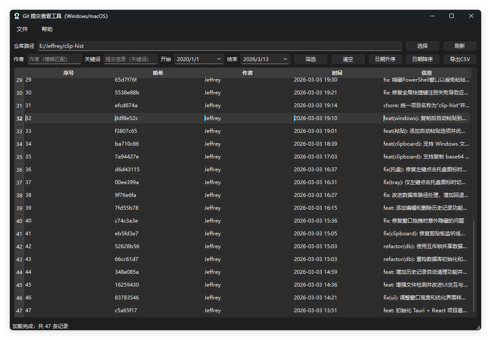

# Git Commit Viewer（桌面版）

一个跨平台的 Git 提交记录查看工具，支持仓库选择、筛选、排序、详情查看、导出 CSV。

## 预览




## 功能

- 选择本地 Git 仓库并加载提交记录
- 按作者 / 邮箱 / 关键词 / 日期范围筛选
- 按日期升序/降序排序
- 双击查看提交详情（完整信息、父提交、统计信息）
- 导出 CSV（UTF-8 带 BOM，Excel/Numbers 打开不乱码）

## 运行环境

- Python 3（建议 3.10+）
- 系统已安装 Git（命令行可用：`git --version`）

## 安装依赖

建议使用虚拟环境：

### Windows（PowerShell）

```bash
cd e:\Jeffrey\git-commit-view
python -m venv .venv
.\.venv\Scripts\Activate.ps1
python -m pip install -r requirements.txt
```

### macOS（Terminal）

```bash
cd /path/to/git-commit-view
python3 -m venv .venv
source .venv/bin/activate
python -m pip install -r requirements.txt
```

## 启动

```bash
python git_commit_viewer.py
```

## 自检（不打开界面）

```bash
python git_commit_viewer.py --self-test 你的仓库路径
```

## 打包（PyInstaller）

打包需要在目标系统上分别执行（Windows 打 Windows 包，macOS 打 macOS 包）。

### Windows 打包为 exe

```bash
python -m pip install pyinstaller
pyinstaller -F -w --name GitCommitViewer git_commit_viewer.py
```

产物在 `dist/` 目录。

### macOS 打包为 app

```bash
python -m pip install pyinstaller
pyinstaller -F -w --name GitCommitViewer git_commit_viewer.py
```

产物在 `dist/` 目录，生成的 `.app` 可以直接双击运行。

## 图标

程序内置了一个简洁图标，已自动设置到应用与窗口。

如果你希望打包后显示自定义图标：

- Windows：准备一个 `.ico` 文件，然后在打包命令中加 `--icon 你的图标.ico`
- macOS：准备一个 `.icns` 文件，然后在打包命令中加 `--icon 你的图标.icns`

## 常见问题

### 1）提示“未找到 Git 命令”

请先安装 Git，并确保命令行可以直接执行：

```bash
git --version
```

### 2）提示“该目录不是 Git 仓库”

请确认选择的是包含 `.git` 的仓库根目录（或仓库内任意子目录也可以）。

